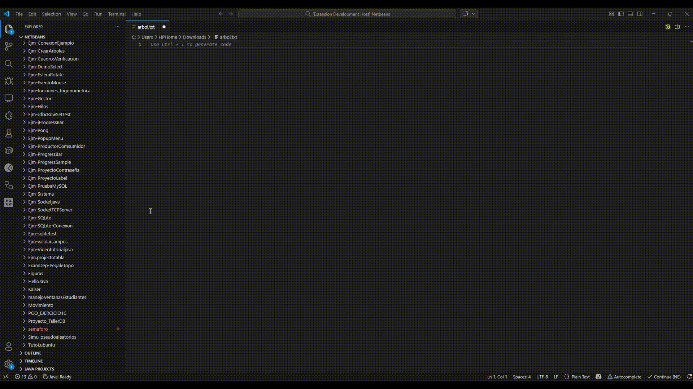

# TreeView Studio 🌳 

<div align="center">

</div>

English | [Español](./README.es.md) | [日本語](./README.ja.md)

[](https://code.visualstudio.com/) [](https://marketplace.visualstudio.com/) [](LICENSE) [](https://nodejs.org/)


<a href="https://www.buymeacoffee.com/dignodev" target="_blank"></a>


A Visual Studio Code extension that generates a directory tree visualization of your project. Perfect for documentation, sharing project structure, or understanding codebase organization.


## Screenshots 

<div align=center>



</div>

## Features

### Core Features
- **Directory Tree Generation**: Creates a visual tree structure of any folder in your project
- **Interactive Prompts**: Ask whether to include hidden files (`.git`, `node_modules`, etc.)
- **Configurable Depth**: Set the maximum depth for the tree visualization
- **Context Menu Integration**: Right-click on any folder in the Explorer to generate its tree
- **Workspace Support**: Works with the entire workspace if no folder is selected
- **Visual Tree Format**: Uses standard tree notation (`├──`, `└──`, `│`) for clear visualization
- **Support the Developer**: Option to donate and support the project development

### New in Version 0.3.2

#### Performance & Caching
- **Smart Cache System**: Automatically caches generated trees for faster access
- **Auto-Invalidation**: Cache automatically clears when files change
- **Manual Cache Clear**: Command to clear cache when needed

#### Multilingual Support
- **6 Languages Supported**: English, Spanish, French, German, Chinese, Japanese
- **Language Switching**: Change language via Command Palette
- **Auto-Detection**: Automatically detects your VS Code language

#### Enhanced UI/UX
- **Real-time Options Panel**: Change settings without regenerating the tree
- **Search & Filter**: Find files and folders quickly
- **Expand/Collapse All**: Navigate large trees easily
- **Customizable Fonts**: Choose your preferred font family and size
- **Collapsible Entries**: Start with folders collapsed by default

#### Export & Share
- **Copy to Clipboard**: Copy the entire tree or selected portions
- **Export to File**: Save tree as a text file

## Installation

### From Source

1. Clone this repository:
   ```bash
   git clone https://github.com/dignodev/treeview-studio.git
   cd treeview-studio/tree-generator
   ```

2. Install dependencies:
   ```bash
   npm install
   ```

3. Compile TypeScript:
   ```bash
   npm run compile
   ```

### Package and Install (.vsix)

To create and install the extension package:

1. Install the VS Code packaging tool (if not already installed):
   ```bash
   npm install -g vsce
   ```

2. Package the extension:
   ```bash
   cd tree-generator
   vsce package
   ```

3. Install the generated `.vsix` file:
   - Open VS Code
   - Go to Extensions (`Ctrl+Shift+X` or `Cmd+Shift+X` on Mac)
   - Click the `...` menu in the top right
   - Select "Install from VSIX..."
   - Navigate to `tree-generator/tree-generator-0.3.2.vsix`

### Alternative Installation

You can also install directly from the command line:
```bash
code --install-extension tree-generator/tree-generator-0.3.2.vsix
```

## Usage

### Method 1: Context Menu

1. Right-click on any folder in the VS Code Explorer
2. Select **"Generate Directory Tree"** from the context menu
3. Follow the prompts:
   - Choose whether to include hidden files (Yes/No)
   - Enter the maximum depth (leave empty for unlimited)

### Method 2: Command Palette

1. Press `Ctrl+Shift+P` (or `Cmd+Shift+P` on Mac)
2. Type "Generate Directory Tree" or "tree-generator"
3. Press Enter
4. Follow the same prompts as above

### Method 3: Language Switching

1. Press `Ctrl+Shift+P` (or `Cmd+Shift+P` on Mac)
2. Type "Change Language"
3. Select your preferred language
4. Reload VS Code when prompted

### Method 4: Clear Cache

1. Press `Ctrl+Shift+P`
2. Type "Clear Tree Cache"
3. Press Enter

## WebView Interface

The tree is displayed in an interactive WebView with:

- **Search Bar**: Filter files and folders in real-time
- **Options Panel**: 
  - Show/Hide hidden files
  - Adjust maximum depth
  - Show/Hide icons
  - Collapse folders by default
- **Expand All**: Expand all folders
- **Collapse All** (⇅): Collapse all folders
- **Copy**: Copy tree to clipboard
- **Export**: Save tree to a file
- **Statistics**: Shows path, file count, line count, and size

## Supported File Types & Icons 

The extension includes icons for 50+ file types including:

| Category | Extensions |
|----------|------------|
| **Web** | `.html`, `.css`, `.scss`, `.sass`, `.less` |
| **JavaScript/TypeScript** | `.js`, `.jsx`, `.ts`, `.tsx`, `.mjs`, `.cjs` |
| **Frameworks** | React, Vue, Angular, Svelte, Next.js, Node.js |
| **Data** | `.json`, `.xml`, `.yaml`, `.yml`, `.toml`, `.ini` |
| **Documents** | `.md`, `.txt`, `.pdf` |
| **Images** | `.png`, `.jpg`, `.jpeg`, `.svg`, `.ico`, `.gif`, `.webp` |
| **Video/Audio** | `.mp4`, `.mp3`, `.wav`, `.ogg` |
| **Database** | `.sql`, `.db`, `.sqlite`, PostgreSQL, MongoDB |
| **DevOps** | Docker, Kubernetes, Terraform |
| **Programming** | Python, Java, C#, Ruby, Go, Rust, Swift, Kotlin, Scala, PHP |
| **Config** | `.gitignore`, `.env`, `.npmrc` |

## Configuration

You can customize the extension via VS Code Settings:

```json
{
  "tree-generator.fontFamily": "Consolas, Monaco, Courier New, monospace",
  "tree-generator.fontSize": 13,
  "tree-generator.showIcons": true,
  "tree-generator.includeHidden": false,
  "tree-generator.maxDepth": 10,
  "tree-generator.collapseEntries": false
}
```

### Settings Options

| Setting | Type | Default | Description |
|---------|------|---------|-------------|
| `fontFamily` | string | Consolas, Monaco, Courier New, monospace | Font family for the tree |
| `fontSize` | number | 13 | Font size for the tree |
| `showIcons` | boolean | true | Show file type icons |
| `includeHidden` | boolean | false | Include hidden files (.git, node_modules) |
| `maxDepth` | number | 10 | Maximum directory depth |
| `collapseEntries` | boolean | false | Start with folders collapsed |

## Example Output

```
mi-proyecto/
├── src/
│   ├── components/
│   │   ├── Header.tsx
│   │   ├── Footer.tsx
│   │   └── Sidebar/
│   │       ├── Menu.tsx
│   │       └── Navbar.tsx
│   ├── styles/
│   │   ├── main.css
│   │   └── variables.css
│   └── index.ts
├── public/
│   ├── index.html
│   └── favico.ico
├── package.json
├── tsconfig.json
└── README.md
```

## Requirements

- Visual Studio Code version 1.85.0 or higher
- Node.js 16.x or higher

## Development

### Setup Development Environment

```bash
cd tree-generator
npm install
```

### Run in Development Mode

1. Press `F5` in VS Code
2. A new VS Code window will open with the extension loaded
3. Test the extension by right-clicking on a folder

### Build for Production

```bash
npm run vscode:prepublish
```

## Project Structure

```
VSCode-Tree-Github/
├── tree-generator/
│   ├── src/
│   │   ├── extension.ts      # Main extension source code
│   │   └── i18n.ts          # Internationalization service
│   ├── locales/             # Translation files
│   │   ├── en/translation.json
│   │   ├── es/translation.json
│   │   ├── fr/translation.json
│   │   ├── de/translation.json
│   │   ├── zh/translation.json
│   │   └── ja/translation.json
│   ├── resources/
│   │   ├── fonts/           # Custom fonts
│   │   └── icons/           # File type icons
│   ├── out/                 # Compiled JavaScript
│   ├── package.json         # Extension manifest
│   └── tsconfig.json        # TypeScript configuration
├── LICENSE                  # MIT License
└── README.md               # This file
```

## Contributing

Contributions are welcome! Please feel free to submit a Pull Request.

## License

This project is licensed under the MIT License - see the [LICENSE](LICENSE) file for details.

## Author

Created with ❤️ for the VS Code community.

---

**Enjoy generating directory trees! 🌳**
